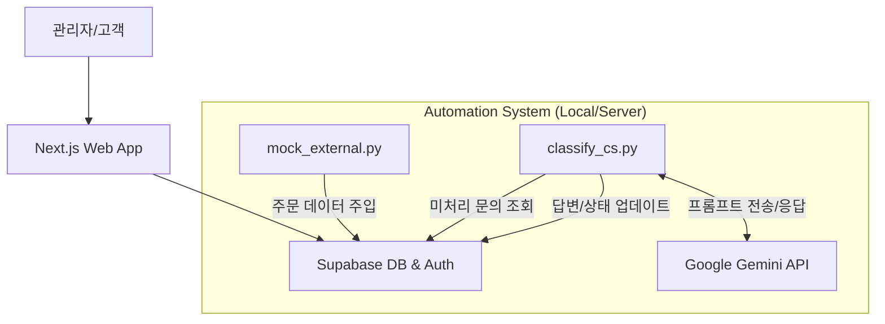

# 🛒 Super Seller: AI 기반 커머스 통합 운영 시스템
> **"흩어진 주문을 한곳으로, 반복되는 CS는 AI에게."**
> 실전형 커머스 백오피스 & AI 에이전트 자동화 프로젝트

## 🔗 배포 링크 (Live Demo)
👉 **서비스 바로가기:** [Super Seller](https://super-seller.vercel.app)
*(계정 없이도 대시보드 조회가 가능하도록 설정되어 있습니다.)*

---

## 📝 목차 (Table of Contents)
1. 프로젝트 개요 (Overview)
2. 개발 동기 (Why)
3. 핵심 기능 (Key Features)
4. 기술 스택 및 아키텍처 (Tech Stack)
5. 트러블 슈팅 (Troubleshooting)
6. 설치 및 실행 방법 (Getting Started)

---

## 🧐 프로젝트 개요 (Overview)
**Super Seller**는 자사몰과 외부몰(네이버, 쿠팡 등)로 파편화된 주문 데이터를 통합 관리하고, 반복되는 고객 문의(CS)를 생성형 AI(LLM)가 자동으로 분석하여 처리하는 **커머스 운영 효율화 시스템**입니다. 단순한 쇼핑몰 구축이 아닌, **"운영자의 리소스를 줄이는 백엔드 자동화"**에 초점을 맞췄습니다.

---

## 💡 개발 동기 (Why)
> **"매출이 늘어날수록, 운영자는 왜 더 바빠져야 할까?"**

쇼핑몰을 운영할 때 가장 큰 비효율은 **'데이터의 분절'**과 **'단순 반복 CS'**에서 발생합니다.
* **문제점:** 여러 판매 채널(자사몰, 스마트스토어 등)의 주문을 각각 엑셀로 다운받아 합치는 과정에서 시간 소모와 오류 발생.
* **해결책:** Python 스크립트를 활용한 **주문 수집 자동화**와 Gemini API를 활용한 **CS 답변 자동 생성** 시스템을 구축하여, 운영자가 '전략'에만 집중할 수 있는 환경을 만들고자 했습니다.

---

## ✨ 핵심 기능 (Key Features)

### 1. 다채널 주문 통합 (Omni-channel Integration)
* **기능:** 자사몰의 실시간 주문과 외부 채널(네이버, 쿠팡 등)의 주문을 하나의 DB로 통합.
* **구현:** Python 기반의 Mock Server(`scripts/mock_external.py`)를 구축하여 외부 API 연동 시나리오를 시뮬레이션하고, 이기종 데이터를 표준화하여 적재합니다.

<br/>
▲ 실시간 통합 매출 대시보드 화면
<br/>

### 2. AI CS 에이전트 (AI Customer Service Agent)
* **기능:** 고객 문의 내용을 분석하여 **[배송/환불/기타]**로 자동 분류하고, 맥락에 맞는 답변 초안을 작성.
* **구현:** Google Gemini Pro 모델에 **Persona Prompting**을 적용하여 상담원 톤앤매너를 학습시켰으며, 처리된 건은 DB 상태값을 변경하여 워크플로우를 종결합니다.
* 👉  *[python-cs-classifier.md](./docs/python-cs-classifier.md) 파일 참조*

<br/>
▲ AI CS 에이전트 화면

---

## 🛠 기술 스택 및 아키텍처 (Tech Stack)

### Stack Detail

| 분류 | 기술 스택 |
| :--: | :-- |
| **Frontend** |    |
| **Backend** |   |
| **AI & Auto** |   |
| **Deploy** |   |


### Architecture



## 🧨 트러블 슈팅 
개발 과정에서 직면한 문제와 해결 과정을 기록했습니다. 단순한 에러 로그가 아니라, **"왜 안 되는지"** 파고들어 원인을 규명하고 시스템을 안정화하는 데 집중했습니다.

### Issue 1: 환경 변수 파일명 실수 
* **문제 상황:** Supabase API Key를 발급받았음에도 `Error: Your project's URL and Key are required` 에러가 무한 반복됨.
* **원인 분석:** 파일 탐색기에서 확인해 보니, 파일명이 `.env.local`이 아니라 예제 파일인 `.env.local.example`로 되어 있었음.
* **해결:** 파일명을 `.env.local`로 수정 후 서버 재시작.
* **Learning Point:** 설정 관련 에러 시 코드보다 **파일명과 경로를 먼저 의심**하는 습관을 들임.

### Issue 2: RLS 정책 문법 오류
* **문제 상황:** 상품 등록(INSERT) 시 `Permission denied` 에러 발생.
* **원인 분석:** `INSERT` 정책 작성 시 `USING (true)`를 사용함. 공식 문서를 확인하니 데이터 삽입 시에는 `WITH CHECK` 구문을 써야 했음.
* **해결:** SQL 정책을 `with check (true)`로 수정하여 해결.
* **Learning Point:** AI가 짜준 SQL이라도 보안 정책(RLS)은 **반드시 공식 문서를 교차 검증**해야 함.

### Issue 3: Server Action 트리거 실패 
* **문제 상황:** 삭제 버튼을 눌러도 아무 반응이 없고 로그도 찍히지 않음.
* **원인 분석:** Next.js Server Actions는 `<form>` 태그의 `submit` 이벤트가 필요한데, 단순 `<button>` 태그만 사용함.
* **해결:** 버튼을 `<form action={deleteProductWithId}>`로 감싸서 해결.

### Issue 4: Python 패키지 충돌
* **문제 상황:** 자동화 스크립트 실행을 위해 `pip install pandas`를 시도했으나, 로컬 PC의 기존 파이썬 버전과 충돌하여 설치 에러 발생.
* **해결 전략 (Sandbox):** 프로젝트만의 독립된 놀이터(가상 환경)가 필요하다고 판단.
* **적용:**
  ```bash
  python -m venv venv      # 가상환경 생성
  source venv/bin/activate 
  pip install pandas
* **성과:** 시스템 전역 설정을 건드리지 않고, 프로젝트별로 완벽하게 격리된 실행 환경 확보.
  

## 📦 설치 및 실행 방법 (Getting Started)

이 프로젝트는 **Next.js (Frontend)**와 **Python (AI Agents)**이 하나의 레포지토리에서 관리되는 모노레포 구조입니다.

### 1. 프로젝트 복제 (Clone)
```bash
git clone [https://github.com/your-username/super-seller.git](https://github.com/your-username/super-seller.git)
cd super-seller
```
### 2. 환경 변수 설정 (Environment Setup)
프로젝트 루트 경로에 `.env.local` 파일을 생성하고, Supabase와 Google Gemini API 키를 설정합니다.

1. `.env.local.example` 파일의 이름을 `.env.local`로 변경합니다.
2. 아래 내용을 채워 넣습니다.

```env
# .env.local

# 1. Supabase Configuration (Database & Auth)
NEXT_PUBLIC_SUPABASE_URL=your_supabase_project_url
NEXT_PUBLIC_SUPABASE_ANON_KEY=your_supabase_anon_key

# 2. Google Gemini API (AI Agent)
GEMINI_API_KEY=your_gemini_api_key
```

### 3. 웹 애플리케이션 실행 (Frontend)
Next.js 기반의 사용자 인터페이스(대시보드)를 실행합니다.

```bash
# 1. 의존성 패키지 설치
npm install

# 2. 개발 서버 시작
npm run dev
```

### 4. AI 에이전트 실행 (Backend Automation)
Python 의존성 충돌 방지를 위해 가상 환경(Virtual Environment) 위에서 실행하는 것을 권장합니다.

```bash
# 가상 환경(venv) 생성
python -m venv venv

# 가상 환경 활성화 (Mac/Linux)
source venv/bin/activate

# 가상 환경 활성화 (Windows PowerShell/CMD)
.\venv\Scripts\activate

# 필수 패키지 설치
pip install -r scripts/requirements.txt

# 스크립트 실행
# 외부몰 주문 수집 시뮬레이터 (Mock Data 생성)
python scripts/mock_external.py

# AI CS 자동 분류 및 답변 초안 생성
python scripts/classify_cs.py

# 재고 부족 알림 봇 가동
python scripts/check_inventory.py
```
